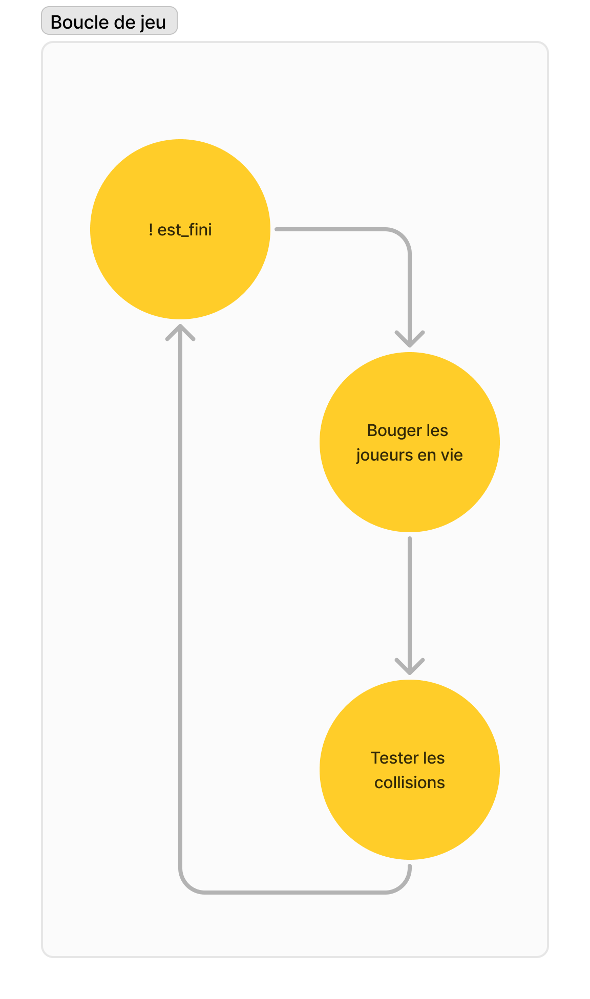
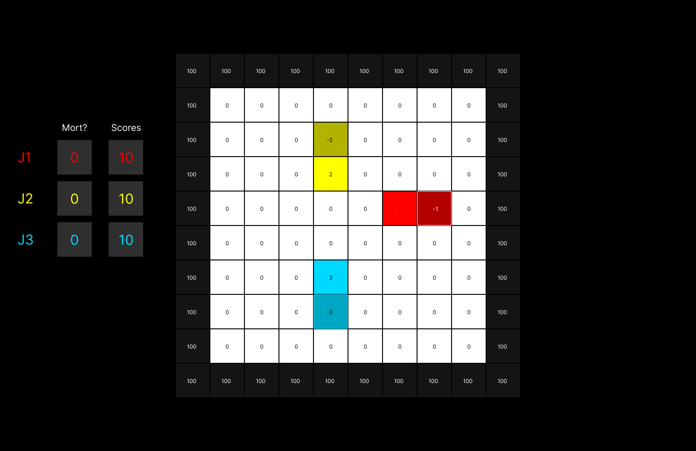
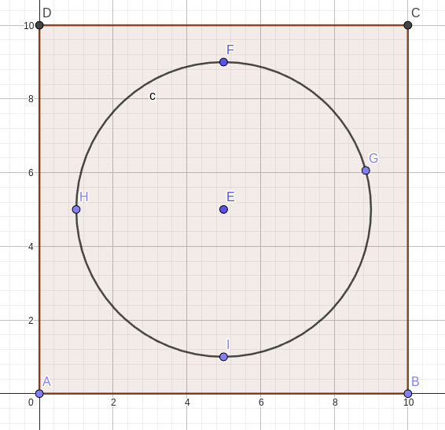
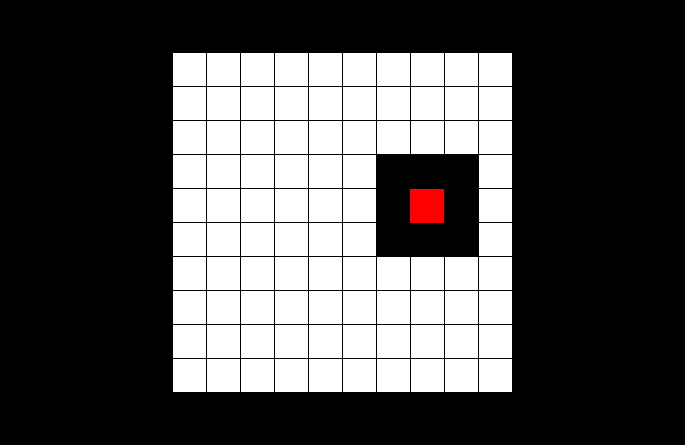
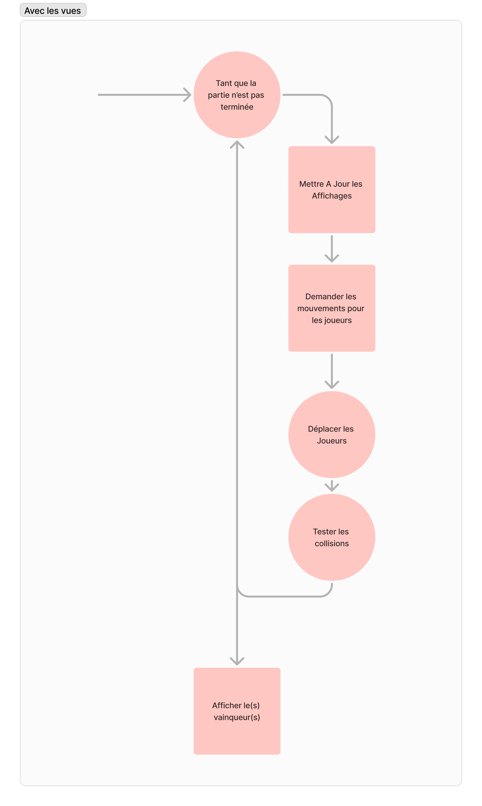
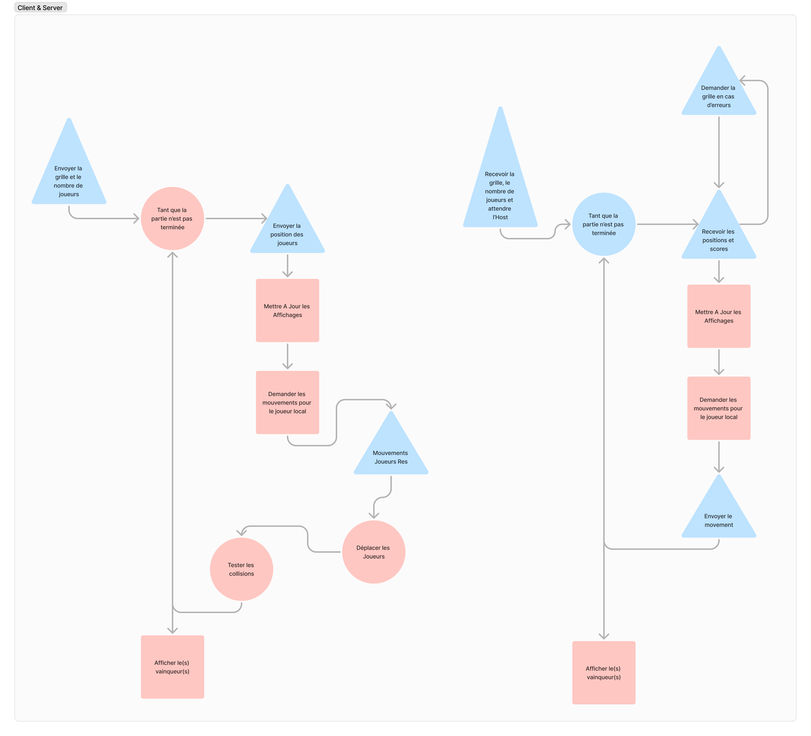

# Développement du Projet

Vous trouverez dans ce document, nos réflexions et idées sur le développement du projet.

Bonne Lecture ! :D

## Sommaire

- [Le Modèle](#le-modèle)
- [Le Contrôleur](#le-contrôleur)
- [Les Vues](#les-vues)
- [La Vue SDL](#la-vue-sdl)
- [La Vue Ncurses](#la-vue-ncurses)
- [Le Contrôleur (encore)](#le-contrôleur-1)
- [Le main.c](#le-mainc)
- [[BONUS] Les Bots](#bonus-les-bots)
- [[BONUS] Du Réseau!](#bonus-du-réseau)
- [Organisation](#organisation)
- [Conclusion](#conclusion)

## Le modèle

Avant de foncer tête baissée dans l'écriture du jeu, nous avons tout d'abord discuté du fonctionnement du jeu, comment se déroule une partie et de nos ambitions pour le projet.

<p style="text-align:center;">
    
</p>

Ce genre de petit schéma est assez simpliste mais nous donne une idée de ce que l’on va manipuler.

Pour le model, il nous faut donc une grille, le plateau de jeu.

Ce plateau de jeu sera représenté par des entiers, avec `0` pour une case vide et un nombre suffisamment grand pour représenter les murs obstacles par défaut sur la carte. (ICI `100`)

Ces valeurs se trouvent dans une enum qui se situe dans le `model.h`.
Les joueurs seront représentés par des valeurs positives et leurs murs de lumières par leur opposé ( -1 pour le mur du joueur 1, 1 pour la moto du joueur J1, -2 pour les murs du joueur 2 etc.).

<p style="text-align:center;">
    
</p>

Dans le modèle nous devons aussi stocker les positions des joueurs si nous ne voulons pas parcourir la grille à chaque tour de boucle pour les trouver.

Il nous faut aussi stocker le nombre de joueurs (pourquoi se limiter à 2 joueurs ?), leur état de vie ou de mort, les différents scores ainsi que le nombre de joueurs en vie, afin de ne pas parcourir le tableau d’état de vie ou de mort à chaque test.

Une fois tout cela énuméré et récupéré, il faut pouvoir initialiser le modèle, le détruire, déplacer un joueur ( càd tester s’il peut bouger ou s’il entre en collision), tester si la partie est finie et enfin récupérer le vainqueur s’il y en a un (cas d’égalité).

Il nous faut une grille de jeu, 2 choix : une grille par défaut, une grille choisie par l’utilisateur.

Nous avons donc la possibilité de créer nos propres cartes, avec nos propres obstacles etc.

Il faut donc implémenter une manière de récupérer les cartes et de les agrandir si on veut faire un peu de responsive, ou si l’utilisateur nous fournit une carte trop petite.

On lit donc le fichier comportant la carte, si la moindre chose se passe mal on essaye de générer la grille par défaut.

Si la grille est trop petite, on l’upscale.
### Exemple :

```plaintext
###
# #
###
```
*Ceci est une carte (oui, pour de vrai).* 

<br>
Le fait qu’il y ait un nombre variable de joueur ( + que 2  voire infini !!! ) 
nous empêche de positionner les joueurs à la main. 

Il nous faut donc une manière de les positionner proprement et de manière équitable.

Pour cela, on trace un cercle au centre de la grille avec, une petite marge pour éviter d’être collé aux murs, puis on tourne sur ce cercle avec les fonctions trigo et on divise le cercle par le nombre de joueurs. 

Simple et efficace. 

<p style="text-align:center;">
    
</p>

Mais il y a un autre problème, c’est si la position initiale choisie est un mur sur la carte (l’utilisateur peut être vicieux). 

Il faut donc faire un parcours en largeur pour trouver la case libre la plus proche, ce qui nécessite l’implémentation d’autres structures de données:
- une File (qui sera une Pile si on veut un DFS)
- un set ( en hashmap pour plus d'efficacité)
- et évidemment les maillons de liste chainées pour résoudre les collisions et pour notre File/Pile

<p style="text-align:center;">
    
</p>

Il faut aussi une liste de directions pour les joueurs. A l’initialisation, tant que l’utilisateur n’a pas encore interagi, sa moto ira vers le centre (par rapport à la position des joueurs).

## Le Contrôleur

Voici un schéma un peu plus complet d’une boucle de jeu : 

<p style="text-align:center;">
    
</p>

Dans le [cahier des charges](./Consignes.md), nous voulons changer d’interface ncurses ou SDL au lancement, mais pourquoi pas les deux en même temps ?

Il nous faut donc une manière générique de représenter nos vues.

Nous reviendrons un peu plus tard sur le contrôleur.

## Les Vues

Pour cette vue générique nous voulons pouvoir mettre à jour l’écran, mettre à jour les changement de l’écran, récupérer les directions utilisateurs, (initialiser et détruire), afficher le vainqueur et afficher des menus et l’action effectuée.

La vue stockera également la taille de la grille.

Il nous suffit donc de créer la structure avec les pointeurs de fonctions qui vont bien et les données que nous voulons sauvegarder et auxquelles nous souhaitons acceder avec le contrôleur.

## La Vue SDL

Nous avons donc besoin de sauvegarder quelques données spécifiques à sdl ou Ncurses, que nous allons stocker dans la structure view.

En bref, dans le cas de SDL, une fenêtre et un renderer sont initialisés comme éléments principaux pour dessiner l’interface du jeu. 

La grille de jeu est représentée par des rectangles pleins, où chaque élément est associé à une couleur spécifique. Chaque rectangle agit comme un "pixel" agrandi pour représenter les différents éléments du jeu, différents éléments reconnaissables grâce à leur couleur.

Les mouvements des joueurs sont capturés grâce à la gestion des événements de SDL_Event, qui traduit les interactions utilisateur en actions dans le jeu, comme les directions.

Le code est plutôt complexe notamment en raison de la gestion des textures et de la mémoire mais offre une interface graphique plus détaillée.

## La Vue Ncurses

Dans le cas de Ncurses, l'interface du jeu est directement créée dans le terminal, sans nécessiter la gestion de surfaces ou de textures. La grille est affichée en utilisant des caractères spéciaux, tandis que les joueurs sont représentés par des symboles simples. 

Cette approche repose entièrement sur un affichage textuel, limitant les possibilités graphiques mais restant très efficace pour une utilisation dans un terminal.

Chaque mise à jour de l'écran modifie uniquement les cellules qui ont changé, optimisant ainsi les performances dans cet environnement minimaliste.
Les mouvements des joueurs sont capturés via la fonction getch, qui récupère les entrées clavier en temps réel. 

Nous avons donc implémenté la vue pour SDL et pour ncurses.

Nous pouvons retourner au contrôleur.

## Le Contrôleur

Pour cette partie du code, entre controller et vues, nous avons fait beaucoup de petits ajustements selon nos besoin, ce n’est donc pas le plus intéressant.

On écrit la boucle de jeu telle qu’elle est décrite sur le schéma et ça y est, ça fonctionne...

On ajoute juste une durée fixe pour chaque tour de boucle afin d'éviter qu’une partie dure 1 nanoseconde et voilà, ça fonctionne, encore mieux.

Pour l’affichage des menus, on pose une liste d’actions possibles, ainsi une boucle pour afficher les menus et les événements.

On a d’abord écrit une fonction pour chaque menu, avant de les réunir car leur fonctionnement était le même. On a ajouté par la suite un paramètre sur les appels des vues (nbMenu), ainsi qu’un entier pour afficher le menu sélectionné pour Ncurses. Pour SDL, ce sera le click sur un bouton.

On écrit un grand switch pour les actions et ça y est, le contrôleur est terminé. 

## Le main.c

Comme nous souhaitons changer d’interface au lancement du jeu, nous imaginons qu’il faut le faire sur la ligne de commande avec des options.

S’il y a -sdl, on initialise la SDL et une vue SDL. S’il y a -nc ou -ncurse ou -ncurses on initialise ncurses et une vue ncurse.

On initialise le contrôleur avec  les vues qui vont bien, une fonction a argument variable donc, pour pouvoir ajouter d’autres vues si on le souhaite.

On en profite pour ajouter l’option -map pour choisir la carte et tester notre jeu sans recompiler à chaque fois.

## [BONUS] Les Bots

Pour les modes de jeu, nous avons conçu plusieurs algorithmes pour jouer contre.

En mode alphonse, l'algorithme maintient une direction tant que la case suivante est libre. Si cette case est occupée, il sélectionne une case aléatoire parmi celles qui sont accessibles et vides. 

> Vas-y ! Fonce Alphonse !!

--- 
En mode kami cases (*ce n'est pas une faute*), l'algorithme choisit la case libre la plus proche de la prochaine position du joueur, dans le but de le bloquer.

--- 
Pour le mode "m’sieur frodon", l’algorithme va essayer d’aller dans la zone la plus grande. Quand le bot se déplace il peut fermer des zones ou avoir le choix d’entrer dans des zones. (zones = composantes connexes pour la grille ). Et Sam (*ie : "m’sieur frodon"*) va se rapprocher du premier joueur dans la liste des personnes en vie et rester collé à lui.

<p style="text-align:center;">
    
</p>

Pour Espace Vital, c’est le même principe, sauf qu’il va essayer de se rapprocher du centre de la map.

---

Pour le bot Q-Learning, Sebastian a suivi la recette sur wikipedia (juste [ici](https://fr.wikipedia.org/wiki/Q-learning)).

Spoiler : ça ne fonctionne pas très bien (21.2% de victoires en moyenne contre alphonse).

## [BONUS] Du Réseau!

En feature bonus, nous avons décidé d'implémenter un mode multijoueur en réseau.
On s’inscrit au cours de réseau M1 sur Moodle et commence les premiers TP’s. Je comprends en surface comment ça fonctionne. 

Je me lance dans l’écriture de petits morceaux de codes pour l’échange de entiers en réseaux. 
Une fois mes tests terminés, je commence à écrire le serveur pour le jeu.

Pour le serveur, nous créons une structure qui contiendra le File Descriptor obtenu de la création du socket, le nombre de connexions que l’on souhaite, le nombre de connexions courantes ainsi que les Files Descriptors Clients.

> Dit-on "la socket", "le socket", "un socket", "une chaussette" ?

Pour chaque données que je souhaite envoyer, je décide que le premier entier (pas char pour me simplifier la vie) annoncera le type de données. Le type est stocké dans une enum dans `network.h`. 
J’écris les fonctions qui permettent d’accepter une connexion, l’envoie des données à un client en particulier, à tous les clients. 

Je me rends compte que la SDL, ne fonctionne plus parce que les événements ne sont plus gérés...

Je passe en mode non bloquant pour le serveur et j’ajoute l’écoute des événements.

On s’occupe ensuite du client, même principe mais énormément de problèmes possibles : les données peuvent ne pas être reçues ou partiellement, ou ça peut prendre du temps de les recevoir. 

On décide de faire quelque chose de fonctionnel et d’aller à l’essentiel, sans toute la gestion d’erreur etc.

Pour la réception des données, lorsque je les reçois, je les sauvegarde dans la structure et ajoute à la liste les types de données reçus. (source de problèmes)

Une fois terminé, on se lance dans l’écriture du contrôleur, mais comme tout est bien écrit, il suffit de faire un copié-collé et de remplacer avec les fonctions qui vont bien.

Je modifie le modèle pour que le client puisse mettre les valeurs qu’il reçoit et tout fonctionne.

A noter que le client est en lecture bloquante et ne gère pas les événements, on ne peut donc plus effectuer d’actions tant que le client est connecté et n’a pas reçu le signal de départ.

J'ajoute les options `-ip`, `-port` et `-h` afin d'éviter du travail supplémentaire à mes camarades sur les menus.

<p style="text-align:center;">
    
</p>

## Organisation

Pour l'entièreté du projet, nous utilisions Figma afin de faire des Schémas ou de représenter ce à quoi pourrait ressembler notre jeu.

Nous avons également utilisé Google Docs afin de noter et partager nos idées.

Et évidemment GitHub pour héberger le projet.

## Conclusion

En globalité, nous avons rencontré seulement de petites difficultés facilement solvables, comme des problèmes de fuite de mémoire liés à la création des boutons du menu avec SDL. 

Nous avions commencé le projet assez tôt afin d’avoir le temps d’implémenter toutes nos idées et surmonter les difficultés rencontrées.

<br>
<p style="text-align:center;">&copy; MAGIEU Piere - LETHOOR Lina - CARON Sebastian</p>