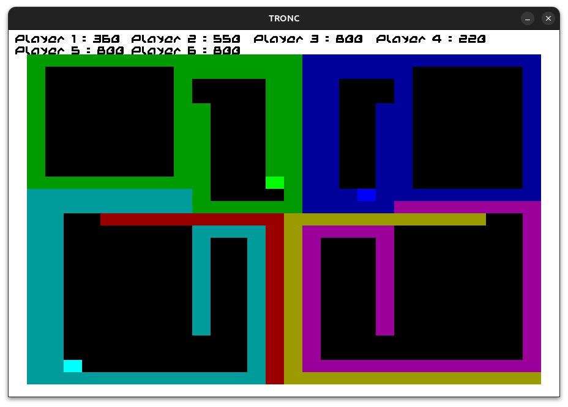

# Tron - C

<p style="text-align:center;">
    
</p>

This project was made by three fantastic students: LETHOOR Lina, MAGIEU Pierre and CARON Sebastian. Inspired by the original TRON game, this project enriches the gaming experience by adding modern features such as local multiplayer, online mode, as well as games against various bots.

## Usage

### Prerequisites

- GCC 9.0+ or equivalent
- SDL2
    ```bash
    sudo apt-get install libsdl2-dev libsdl2-image-dev
    ```
- SDL2_ttf
    ```bash
    sudo apt-get install libsdl2-ttf-dev
    ```
- Ncurses
    ```bash
    sudo apt-get install libncurses5-dev libncursesw5-dev 
    ```
- Valgrind (optional for debug mode)
- A terminal that supports Ncurses


### Installation

1. Clone the repository:
```bash
git clone https://github.com/SebastianCaron/Tron-c.git
```

2. Navigate to the project directory:
```bash
cd Tron-c
```

3. Compile the project:
```bash
make
```

### Makefile Options

- Clean the directory:
```bash
make clean
```

- Clean the directory and remove the executable:
```bash
make mrpropre
```

- Recompile everything:
```bash
make fr0
```

- Debug using Valgrind:
```bash
make debug
```

- Start a client and server to test the Online mode:
```bash
make network
```

- Compile with the bot using the Q-Learning method:
```bash
make bot
```

- Shortcut for training:
```bash
make training
```
or
```bash
make training n=10
```

### Executable Options

It is possible to add options when running the game.

These options are:
- `-sdl` to launch the game with SDL.
- `-ncurses`, `-nc` or `-ncurse` to launch the game with Ncurses.
- `-ip` to configure the IP address.
- `-port` to configure the port.
- `-h` to host a multiplayer game.
- `-bots` to set the number of bots in Solo mode or the number of players in an online game.
- `-map` to select the path to a map.

Example : 
```bash
./tron -sdl -ncurses -ip192.168.0.0 -bots5 -map./maps/map3.txt
```

This launches the game with both Ncurses and SDL interfaces, with 5 bots, using the map `./maps/map3.txt`, and the IP address `192.168.0.0`.

> If you are hosting a multiplayer game, we recommend running it with SDL only and restarting the game between games.

### Options in Q Learning Mode Only: 

When the game is compiled in Q-Learning mode (ie : `make bot` or with the Macro `BOT_TRAINING` set to 1), additional options are available:

- `-train` to enter training mode for the bot.
- `-ep` to choose the number of games the bot will play.

Example : 
```bash
./tron -train -ep10000 -bots5
```

The bot will play 10,000 training games against 5 other bots.


### Controls

When playing in Solo mode, the player can use the Arrow keys for Up, Down, Left, and Right, as well as Z, Q, S, D.

When local multiplayer mode is selected, Player 1 will use the Arrow keys, while Player 2 will use Z, Q, S, D.

## Learn More

If you want to learn more about the instructions, you can consult the [Consignes.md](./Consignes.md) file.

If you want to learn more about the project's development, visit [Project.md](./Project.md).

<br>
<p style="text-align:center;">&copy; MAGIEU Piere - LETHOOR Lina - CARON Sebastian</p>